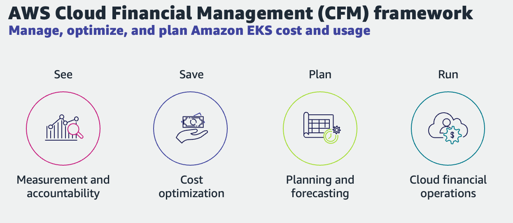
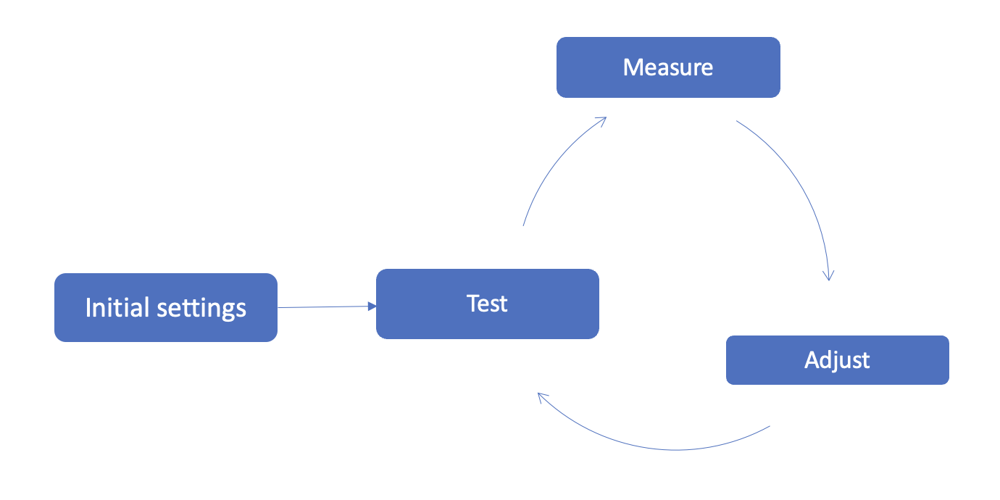

# Cost Optimization - Introduction
AWS Cloud Economics is a discipline that helps customers increase efficiency and reduce their costs through the adoption of modern compute technologies like Amazon EKS. The discipline recommends following a methodology called the “Cloud Financial Management (CFM) framework” which consists of 4 pillars: 

## The See pillar: Measurement and accountability 
The See pillar is a foundational set of activities and technologies that define how to measure, monitor and create accountability for cloud spend. It is often referred to as “Observability”, “Instrumentation”, or “Telemetry”. The capabilities and limitations of the “Observability” infrastructure dictate what can be optimized. Obtaining a clear picture of your costs is a critical first step in cost optimization as you need to know where you are starting from. This type of visibility will also guide the types of activities you will need to do to further optimize your environment.  

Here is a brief overview of our best practices for the See pillar:

* Define and maintain a tagging strategy for your workloads. 
    * Use [Instance Tagging](https://docs.aws.amazon.com/eks/latest/userguide/eks-using-tags.html#tag-resources-for-billing), tagging EKS clusters allows you to see individual cluster costs and allocate them in your Cost & Usage Reports. 
* Establish reporting and monitoring of EKS usage by using technologies like [Kubecost](https://docs.kubecost.com/install-and-configure/install/provider-installations/aws-eks-cost-monitoring). 
    * [Enable Cloud Intelligence Dashboards](https://wellarchitectedlabs.com/cost/200_labs/200_enterprise_dashboards/), by having resources properly tagged and using visualizations, you can measure and estimate costs.
* Allocate cloud costs to applications, Lines of Business (LoBs), and revenue streams.
* Define, measure, and circulate efficiency/value KPIs with business stakeholders. For example, create a “unit metric” KPI that measures the cost per transaction, e.g. a ride sharing services might have a KPI for “cost per ride”.  

For more details on the recommended technologies and activities associated with this pillar, please see the [Cost Optimization - Observability](/content/cost_optimization/cost_opt_observability.md) section of this guide. 

## The Save pillar: Cost optimization 

This pillar is based on the technologies and capabilities developed in the “See” pillar. The following activities typically fall under this pillar: 

* Identify and eliminate waste in your environment. 
* Architect and design for cost efficiency.
* Choose the best purchasing option, e.g. on-demand instances vs Spot instances.
* Adapt as services evolve: as AWS services evolve, the way to efficiently use those services may change. Be willing to adapt to account for these changes. 

Since these activities are operational, they are highly dependent on your environment’s characteristics. Ask yourself, what are the main drivers of costs? What business value do your different environments provide? What purchasing options and infrastructure choices, e.g. instance family types, are best suited for each environment?  

Below is a prioritized list of the most common cost drivers for EKS clusters:

1. **Compute costs:** Combining multiple types of instance families, purchasing options, and balancing scalability with availability require careful consideration. For further information, see the recommendations in the [Cost Optimization - Compute](/content/cost_optimization/cost_opt_compute.md) section of this guide. 
2. **Networking costs:** using 3 AZs for EKS clusters can potentially increase inter-AZ traffic costs. For our recommendations on how to balance HA requirements with keeping network traffic costs down, please consult the [Cost Optimization - Networking](/content/cost_optimization/cost_opt_networking.md) section of this guide. 
3. **Storage costs:** Depending on the stateful/stateless nature of the workloads in the EKS clusters, and how the different storage types are used, storage can be considered as part of the workload. For considerations relating to EKS storage costs, please consult the [Cost Optimization - Storage](/content/cost_optimization/cost_opt_storage.md) section of this guide.

## The Plan pillar:  Planning and forecasting

Once the recommendations in the See pillar are implemented, clusters are optimized on an on-going basis. As experience is gained in operating clusters efficiently, planning and forecasting activities can focus on:

* Budgeting and forecasting cloud costs dynamically. 
* Quantifying the business value delivered by EKS container services.
* Integrating EKS cluster cost management with IT financial management planning. 

## The Run pillar 

Cost optimization is a continuous process and involves a flywheel of incremental improvements: 

Securing executive sponsorship for these types of activities is crucial for integrating EKS cluster optimization into the organization’s “FinOps” efforts. It allows stakeholder alignment through a shared understanding of EKS cluster costs, implementation of EKS cluster cost guardrails, and ensuring that the tooling, automation, and activities evolve with the organization’s needs. 

## References
* [AWS Cloud Economics, Cloud Financial Management](https://aws.amazon.com/aws-cost-management/)

