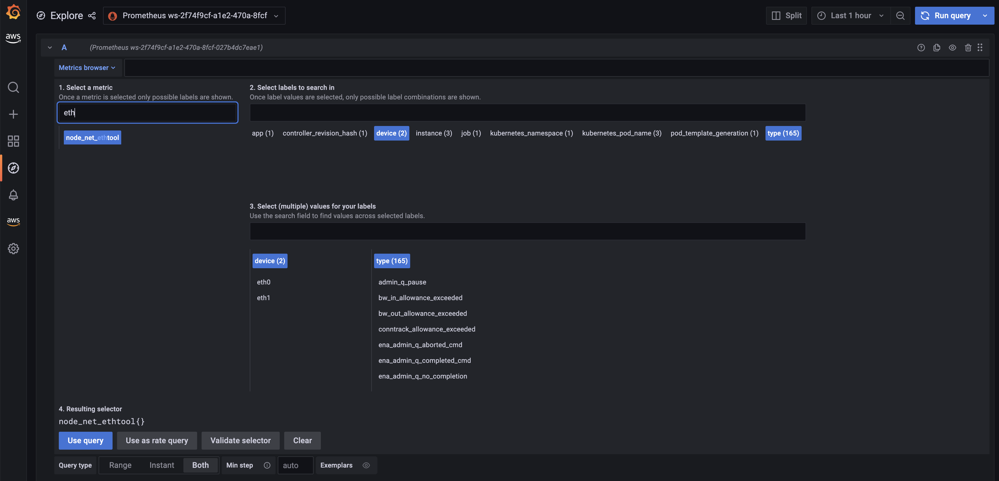

# Monitoring CoreDNS traffic for DNS throttling issues

EKS customers running DNS intensive workloads can sometimes experience intermittent CoreDNS failures due to DNS throttling, and this can impact applications where customers may encounter occasional UnknownHostException errors.

Each AWS EC2 instance can send 1024 packets per second per network interface to Route 53 Resolver. This quota cannot be increased. If you reach the quota, the Route 53 Resolver rejects traffic. Some of the causes for reaching the quota might be a DNS throttling issue

## Challenge
 * Packet drop happens in seconds and it can be tricky for customers to properly monitor these patterns to determine if DNS throttling is actually happening.
 * DNS queries are throttled at the elastic network interface level. So, throttled queries don't appear in the query logging. 
 * Flow logs do not capture all IP traffic. E.g. Traffic generated by instances when they contact the Amazon DNS server. If you use your own DNS server, then all traffic to that DNS server is logged

 ## Capturing the metrics to identify throttling issues

 An easy way to guide customers in identifying the DNS throttling issues in worker nodes is by capturing few key network performance metrics.
 The Elastic Network Adapter (ENA ) driver publishes network performance metrics from the instances where they are enabled. Customers can troubleshoot DNS throttling using the linklocal_allowance_exceeded metric. The [linklocal_allowance_exceeded](https://docs.aws.amazon.com/AmazonCloudWatch/latest/monitoring/metrics-collected-by-CloudWatch-agent.html#linux-metrics-enabled-by-CloudWatch-agent) is number of packets dropped because the PPS of the traffic to local proxy services exceeded the maximum for the network interface. This impacts traffic to the DNS service, the Instance Metadata Service, and the Amazon Time Sync Service. Instead of tracking this event real-time, we can stream this metric to [Amazon Managed Service for Prometheus](https://aws.amazon.com/prometheus/) and have them visualized in [Amazon Managed Grafana](https://aws.amazon.com/grafana/)

 ## Prerequisites
  * ethtool - Ensure the worker nodes have ethtool installed
  * An AMP workspace configured in your AWS account. For instructions, see [Create a workspace](https://docs.aws.amazon.com/prometheus/latest/userguide/AMP-onboard-create-workspace.html) in the AMP User Guide.
  * Amazon Managed Grafana Workspace

 ## Deploying Prometheus ethtool exporter
 The deployment contains a python script that pulls information from ethtool and publishes it in prometheus format.

```
kubectl apply -f https://raw.githubusercontent.com/Showmax/prometheus-ethtool-exporter/master/deploy/k8s-daemonset.yaml
```

 ## Deploy the ADOT collector to scrape the ethtool metrics and store in Amazon Managed Service for Prometheus workspace

 Each cluster where you install AWS Distro for OpenTelemetry (ADOT) must have this role to grant your AWS service account permissions to store metrics into Amazon Managed Service for Prometheus. Follow these steps to create and associate your IAM role to your Amazon EKS service account using IRSA:

```
eksctl create iamserviceaccount     --name adot-collector     --namespace default     --cluster <Your Cluster> --attach-policy-arn arn:aws:iam::aws:policy/AmazonPrometheusRemoteWriteAccess --attach-policy-arn arn:aws:iam::aws:policy/AWSXrayWriteOnlyAccess --attach-policy-arn arn:aws:iam::aws:policy/CloudWatchAgentServerPolicy --region <Your Region> --approve  --override-existing-serviceaccounts
```

Let's deploy the ADOT collector to scrape the metrcis from the prometheus ethtool exporter and store it in Amazon Managed Service for Prometheus

The following procedure uses an example YAML file with deployment as the mode value. This is the default mode and deploys the ADOT Collector similarly to a standalone application. This configuration receives OTLP metrics from the sample application and Amazon Managed Service for Prometheus metrics scraped from pods on the cluster

```
curl -o collector-config-amp.yaml https://raw.githubusercontent.com/aws-observability/aws-otel-community/master/sample-configs/operator/collector-config-amp.yaml
```
In collector-config-amp.yaml, replace the following with your own values:
* mode: deployment
* serviceAccount: adot-collector
* endpoint: "<YOUR_REMOTE_WRITE_ENDPOINT>"
* region: "<YOUR_AWS_REGION>"
* name: adot-collector

```
kubectl apply -f collector-config-amp.yaml 
```
Once the adot collector is deployed, the metrics will be stored successfully in Amazon Prometheus

 ## Visualize ethtool metrics in Amazon Managed Grafana

Let's visualize the linklocal_allowance_exceeded within the Amazon Managed Grafana and build a dashboard. Configure the Amazon Managed Service for Prometheus as a datasource inside the Amazon Managed Grafana console. For instructions, see [Add Amazon Prometheus as a datasource](https://docs.aws.amazon.com/grafana/latest/userguide/AMP-adding-AWS-config.html)

Let's explore the metrics in Amazon Managed Grafana now:
Click the explore button, and search for ethtool :



Let's build a dashboard for the linklocal_allowance_exceeded metric by using the query `node_net_ethtool{device="eth0",type="linklocal_allowance_exceeded"}`. It will result in the below dashboard. 


We can clearly see that there were no packets dropped as the value is zero. You can further extend this by configuring alerts in Amazon Managed Grafana to send notifications to Slack, SNS, Pagerduty etc.


