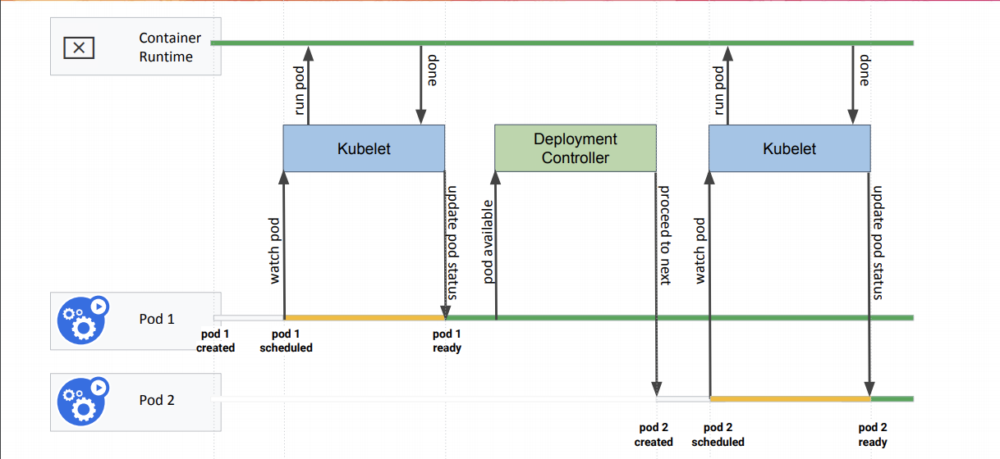
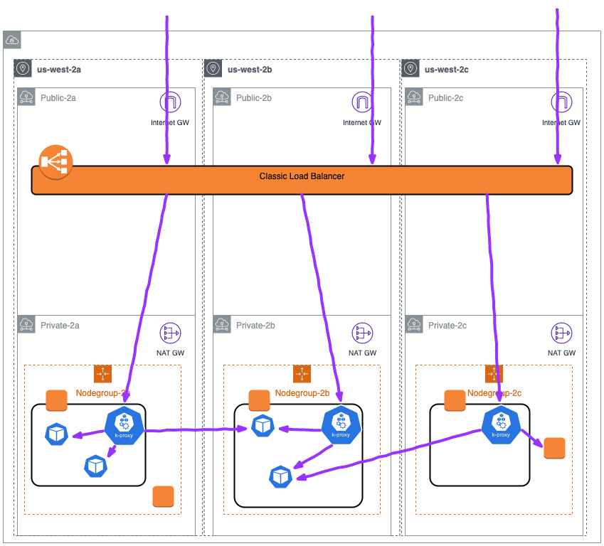
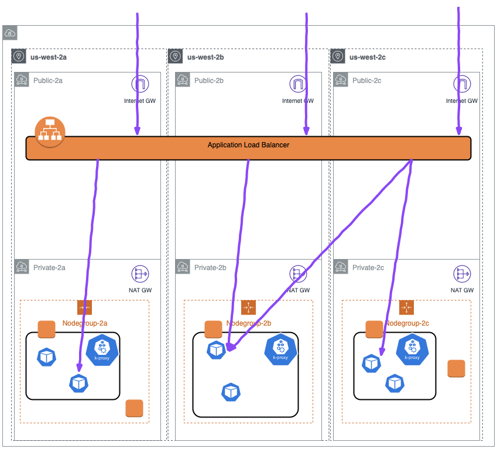

# Avoiding Errors & Timeouts with Kubernetes Applications and AWS Load Balancers

After creating the necessary Kubernetes resources (Service, Deployment, Ingress, etc), your pods should be able to receive traffic from your clients through an Elastic Load Balancer. However, you may find that errors, timeouts, or connection resets are being generated when you make changes to the application or Kubernetes environment. Those changes could be an application deployment or a scaling action (either manual or automatic).

Unfortunately, those errors may be generated even when your application is not logging problems. This is because the Kubernetes systems controlling the resources in your cluster may be running faster than the AWS systems that control the Load Balancer target registration and health. Your Pods may also be receiving traffic before your application has completed it’s startup operations and responding correctly.

Lets review the process through which a pod becomes Ready and how traffic can be routed into the pods.

## Pod Readiness

This diagram from a [2019 Kubecon talk](https://www.youtube.com/watch?v=Vw9GmSeomFg), shows the steps taken for a pod to become Ready and receive traffic for a `LoadBalancer` service:

*[Ready? A Deep Dive into Pod Readiness Gates for Service Health... - Minhan Xia & Ping Zou](https://www.youtube.com/watch?v=Vw9GmSeomFg)*  
When a pod that is a member of a NodePort Service is created, Kubernetes will go through the following steps:

1. The pod is created on the Kubernetes control plane (i.e. from a `kubectl` command or scaling action).
2. The pod is scheduled by the `kube-scheduler` and is assigned to a node in the cluster. 
3. The kubelet running on the assigned node will receive the update (via `watch`) and will communicate with it’s local Container Runtime to start the containers specified in the pod. 
    1. When the containers have started running (and optionally pass `ReadinessProbes`), the kubelet will update the pod status to `Ready` by sending an update to the `kube-apiserver`
4.  The Endpoint Controller will receive an update (via `watch`) that there is a new pod that is `Ready` to be added to the Endpoints list for the Service and will add the pod IP/Port tuples to the appropriate endpoints array.
5. `kube-proxy` receives an update (via `watch`) that there is a new IP/Port to add to the iptables rules for the Service.
    1. The local iptables rules on the worker node will be updated with the additional target pod for the NodePort Service.

***Note**: When using an Ingress resource and Ingress Controller (like the AWS Load Balancer Controller) step 5 is handled by the relevant controller instead of `kube-proxy`. The controller will then take the necessary configuration steps (such as registering/deregistering the target to a load balancer) to allow traffic to flow as expected.* 

[When a pod is terminated](https://kubernetes.io/docs/concepts/workloads/pods/pod-lifecycle/#pod-termination), or changes to a not ready state, a similar process occurs. The API server will receive either an update from a controller, kubelet, or kubectl client to terminate the pod. Steps 3-5 continue from there but will remove the Pod IP/Tuple from the endpoints list and iptables rules rather than insert.

### Impact on Deployments

Below is a diagram showing the steps taken when an application deployment triggers the replacement of pods:

*[Ready? A Deep Dive into Pod Readiness Gates for Service Health... - Minhan Xia & Ping Zou](https://www.youtube.com/watch?v=Vw9GmSeomFg)*  
Of note in this diagram is that the second Pod will not be deployed until the first pod has reached the “Ready” state. Steps 4 and 5 from the previous section will also happen in parallel with the deployment actions above.

This means that the actions to propagate the new pod status may still be in-progress when the Deployment controller moves on to the next pods. Since this process also terminates the older version of pods, this could lead to a situation where the pods have reached a Ready status but those changes are still being propagated and the older versions of the pod have been terminated. 

This problem is exacerbated when working with load balancers from Cloud Providers like AWS as the Kubernetes systems described above do not, by default, take into account registration times or health checks on the Load Balancer. **This means the Deployment update could run and completely cycle the pods, but the Load Balancer has not completed health checks or registration for the new Pods, causing an outage.**

A similar problem occurs when a pod is terminated. Depending on the Load Balancer configuration the Pod may take a minute or two to complete deregistration and stop taking new requests. **Kubernetes does not delay rolling deployments for this deregistration, this can lead to a state where the Load Balancer is still sending traffic to the IP/port for a target Pod that has already been terminated.**

To avoid these problems we can add configuration to ensure the Kubernetes systems take actions more in line with the AWS Load Balancer behavior.

## Recommendations

### Use IP Target-Type Load Balancers

When creating a `LoadBalancer` type service the traffic is sent from the load balancer to *any node in the cluster* via **Instance target type** registration. Each node then redirects the traffic from the `NodePort` to a Pod/IP tuple in the Service’s Endpoints array, this target could be running on a separate worker node (***Note:*** *Remember that array should only have “Ready” pods*):


This adds an additional hop to your request, and adds complexity to the Load Balancer configuration. For example, if the Load Balancer above was configured with session affinity, that affinity could only hold between the load balancer and the backend node (depending on the affinity configuration). 

Since the Load Balancer is not communicating with the backend Pod directly, controlling the traffic flow and timing with the Kubernetes systems becomes more difficult.

When using the [AWS Load Balancer Controller](https://github.com/kubernetes-sigs/aws-load-balancer-controller), **IP target type** can be used to register the Pod IP/Port tuples with the Load Balancer directly:
  
This simplifies the traffic path from the Load Balancer to the target Pods. This means when a new target is registered we can be sure that target is a “Ready” Pod IP and port, the health checks from the load balancer will hit the Pod Directly, and when reviewing VPC flow logs or monitoring utilities traffic between the Load Balancer and the Pods will be easily traceable.

Using IP registration also allows us to control the timing and configuration of the traffic directly against the backend Pods, rather than trying to manage connections through the `NodePort` rules as well.

### Utilize Pod Readiness Gates

[Pod Readiness Gates](https://kubernetes.io/docs/concepts/workloads/pods/pod-lifecycle/#pod-readiness-gate) are additional requirements that must be met before the Pod is allowed to reach the “Ready” state.


>[[...] the AWS Load Balancer controller can set the readiness condition on the pods that constitute your ingress or service backend. The condition status on a pod will be set to `True` only when the corresponding target in the ALB/NLB target group shows a health state of »Healthy«. This prevents the rolling update of a deployment from terminating old pods until the newly created pods are »Healthy« in the ALB/NLB target group and ready to take traffic.](https://kubernetes-sigs.github.io/aws-load-balancer-controller/v2.4/deploy/pod_readiness_gate/)


The readiness gates ensure that Kubernetes doesn’t move “too fast” when creating new replicas during a deployment and avoids the situation where Kubernetes has completed the deployment but the new Pods have not completed registration.

To enable these you will need to:

1. Deploy the latest version of the [AWS Load Balancer Controller](https://github.com/kubernetes-sigs/aws-load-balancer-controller) (**[*Refer to the documentation if upgrading older versions*](https://kubernetes-sigs.github.io/aws-load-balancer-controller/v2.4/deploy/upgrade/migrate_v1_v2/)**)
2. [Label the namespace where the target pods are running](https://kubernetes-sigs.github.io/aws-load-balancer-controller/v2.4/deploy/pod_readiness_gate/) with the `elbv2.k8s.aws/pod-readiness-gate-inject: enabled` label to inject Pod Readiness Gates automatically.
3. To ensure all of your pods in a namespace get the readiness gate config, you need create your Ingress or Service and label the namespace ***before*** creating the pods.

### Ensure Pods are Deregistered from Load Balancers *before* Termination

When a pod is terminated steps 4 and 5 from the pod readiness section occur at the same time that the container processes receive the termination signals. This means that if your container is able to shut down quickly it may shut down faster than the Load Balancer is able to deregister the target. To avoid this situation adjust the Pod spec with:

1. Add a `preStop` lifecycle hook to allow the application to deregister and gracefully close connections. This hook is called immediately before a container is terminated due to an API request or management event such as a liveness/startup probe failure, preemption, resource contention and others. Critically, [this hook is called and allowed to complete **before** the termination signals are sent](https://kubernetes.io/docs/concepts/workloads/pods/pod-lifecycle/#pod-termination), provided the grace period is long enough to accommodate the execution.

```
        lifecycle:
          preStop:
            exec:
              command: ["/bin/sh", "-c", "sleep 180"] 
```

A simple sleep command like the one above can be used to introduce a short delay between when the pod is marked `Terminating` (and Load Balancer deregistration begins) and when the termination signal is sent to the container process. If needed this hook can also be leveraged for more advanced application termination/shutdown procedures.

2. Extend the `terminationGracePeriodSeconds` to accommodate the entire `prestop` execution time, as well as the time your application takes to gracefully respond to the termination signal. In the example below the grace period is extended to 200s which allows the entire `sleep 180` command to complete and then an extra 20s just to be sure my app can shutdown gracefully.

```
    spec:
      terminationGracePeriodSeconds: 200
      containers:
      - name: webapp
        image: webapp-st:v1.3
        [...]
        lifecycle:
          preStop:
            exec:
              command: ["/bin/sh", "-c", "sleep 180"] 
```

### Ensure Pods have Readiness Probes

When creating Pods in Kubernetes the default Readiness state is “Ready”, however most applications take a moment or two to instantiate and become ready for requests. [You can define a `readinessProbe` in the Pod spec](https://kubernetes.io/docs/tasks/configure-pod-container/configure-liveness-readiness-startup-probes/) with an exec command or network request that is used to determine if the application has completed its start up and is ready for traffic. 

Pods that are created with a `readinessProbe` defined start in a “NotReady” state, and only change to “Ready” when the `readinessProbe` is successful. This ensures that applications are not put “in-service” until the application has completed startup.

Liveness probes are recommended to allow for application restarts when entering a broken state, however care should be taken with stateful applications as liveness failures will trigger a restart of the application. Startup probes can also be leveraged for applications that are slow to start.

The below probes use HTTP probes against port 80 to check when the web application becomes ready (the same probe configuration is also used for the liveness probe):

```
        [...]
        ports:
        - containerPort: 80
        livenessProbe:
          httpGet:
            path: /
            port: 80
          failureThreshold: 1
          periodSeconds: 10
          initialDelaySeconds: 5
        readinessProbe:
          httpGet:
            path: /
            port: 80
          periodSeconds: 5
        [...]
```

### Configure a Pod Disruption Budget

>A [Pod Disruption Budget (PDB)](https://kubernetes.io/docs/concepts/workloads/pods/disruptions/#pod-disruption-budgets) limits the number of Pods of a replicated application that are down simultaneously from [voluntary disruptions](https://kubernetes.io/docs/concepts/workloads/pods/disruptions/#voluntary-and-involuntary-disruptions). For example, a quorum-based application would like to ensure that the number of replicas running is never brought below the number needed for a quorum. A web front end might want to ensure that the number of replicas serving load never falls below a certain percentage of the total.


The PDB will protect the application against things like the nodes being drained, or application deployments. The PDB ensures that a minimum number or percentage of pods remain available while taking these actions. **PDB’s will NOT protect the application against involuntary disruptions like a failure in the host OS or loss of network connectivity.** 

The example below ensures that there is always at least 1 Pod available with the label `app: echoserver`. [You can configure the correct replica count for your application or use a percentage](https://kubernetes.io/docs/tasks/run-application/configure-pdb/#think-about-how-your-application-reacts-to-disruptions):

```
apiVersion: policy/v1beta1
kind: PodDisruptionBudget
metadata:
  name: echoserver-pdb
  namespace: echoserver
spec:
  minAvailable: 1
  selector:
    matchLabels:
      app: echoserver
```

### Gracefully handle Termination Signals

When a pod is Terminated the application running inside the container will receive two [Signals](https://www.gnu.org/software/libc/manual/html_node/Standard-Signals.html). The first is the [`SIGTERM` signal](https://www.gnu.org/software/libc/manual/html_node/Termination-Signals.html), which is a “polite” request that the process cease execution. This signal can be blocked or the application could simply ignore this signal, so after the `terminationGracePeriodSeconds` has elapsed the application will receive the [`SIGKILL` signal](https://www.gnu.org/software/libc/manual/html_node/Termination-Signals.html). `SIGKILL` is used to forcibly stop a process, it cannot be [blocked, handled or ignored](https://man7.org/linux/man-pages/man7/signal.7.html), and is therefore always fatal.

These Signals are used by the container runtime to trigger your application to shutdown. The `SIGTERM` signal will also be sent **after** the `preStop` hook has executed. With the above configuration the `preStop` hook will ensure the pod has been deregistered from the Load Balancer, so the application can then gracefully closes any remaining open connections when the `SIGTERM` signal is received. 

***Note:*** [*Signal handling in container environments can be complicated when using “wrapper scripts” for the entrypoint of your application*](https://petermalmgren.com/signal-handling-docker/) *as the script will be PID 1 and may not forward the signal to your application.*


### Be Wary of the Deregistration Delay 

Elastic Load Balancing stops sending requests to targets that are deregistering. By default, Elastic Load Balancing waits 300 seconds before completing the deregistration process, which can help in-flight requests to the target to complete. To change the amount of time that Elastic Load Balancing waits, update the deregistration delay value.
The initial state of a deregistering target is `draining`. After the deregistration delay elapses, the deregistration process completes and the state of the target is `unused`. If the target is part of an Auto Scaling group, it can be terminated and replaced.

If a deregistering target has no in-flight requests and no active connections, Elastic Load Balancing immediately completes the deregistration process, without waiting for the deregistration delay to elapse. **However, even though target deregistration is complete, the status of the target is displayed as `draining` until the deregistration delay timeout expires. After the timeout expires, the target transitions to an `unused` state.**

[If a deregistering target terminates the connection before the deregistration delay elapses, the client receives a 500-level error response](https://docs.aws.amazon.com/elasticloadbalancing/latest/application/load-balancer-target-groups.html#deregistration-delay).

This can be configured using annotations on the Ingress resource using the[`alb.ingress.kubernetes.io/target-group-attributes` annotation](https://kubernetes-sigs.github.io/aws-load-balancer-controller/v2.4/guide/ingress/annotations/#target-group-attributes). Example:

```
apiVersion: networking.k8s.io/v1
kind: Ingress
metadata:
  name: echoserver-ip
  namespace: echoserver
  annotations:
    alb.ingress.kubernetes.io/scheme: internet-facing
    alb.ingress.kubernetes.io/target-type: ip
    alb.ingress.kubernetes.io/load-balancer-name: echoserver-ip
    alb.ingress.kubernetes.io/target-group-attributes: deregistration_delay.timeout_seconds=30
spec:
  ingressClassName: alb
  rules:
    - host: echoserver.example.com
      http:
        paths:
          - path: /
            pathType: Exact
            backend:
              service:
                name: echoserver-service
                port:
                  number: 8080
```