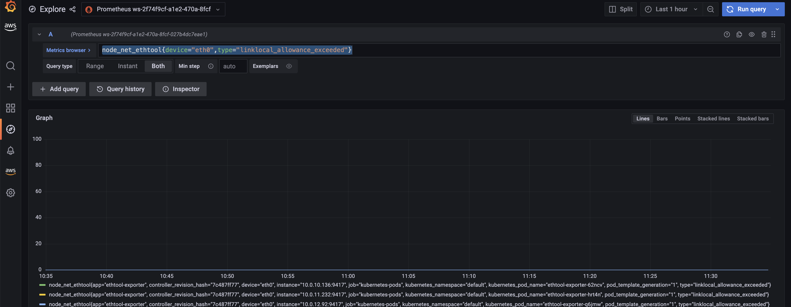
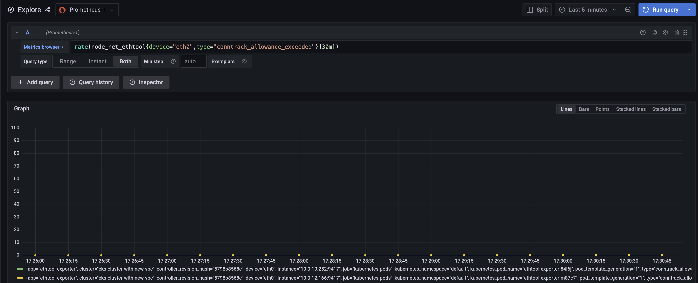
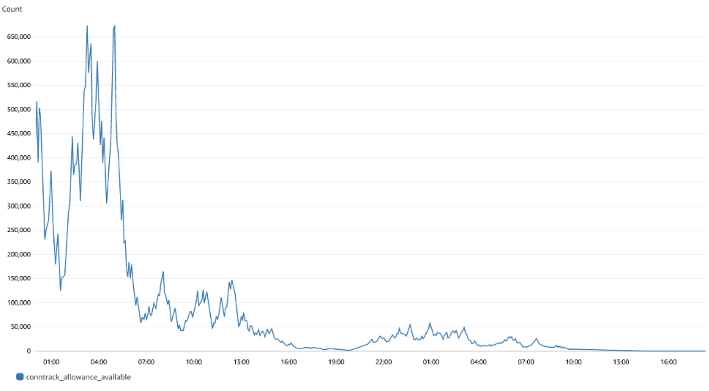

# Monitoring CoreDNS traffic for DNS throttling issues

Running DNS intensive workloads can sometimes experience intermittent CoreDNS failures due to DNS throttling, and this can impact applications where you may encounter occasional UnknownHostException errors.

The Deployment for CoreDNS has an anti-affinity policy that instructs the Kubernetes scheduler to run instances of CoreDNS on separate worker nodes in the cluster, i.e. it should avoid co-locating replicas on the same worker node. This effectively reduces the number of DNS queries per network interface because traffic from each replica is routed through a different ENI. If you notice that DNS queries are being throttled because of the 1024 packets per second limit, you can 1) try increasing the number of CoreDNS replicas or 2) implement [NodeLocal DNSCache](https://kubernetes.io/docs/tasks/administer-cluster/nodelocaldns/). See [Monitor CoreDNS Metrics](https://aws.github.io/aws-eks-best-practices/reliability/docs/networkmanagement/#monitor-coredns-metrics) for further information.

## Challenge
* Packet drop happens in seconds and it can be tricky for us to properly monitor these patterns to determine if DNS throttling is actually happening.
* DNS queries are throttled at the elastic network interface level. So, throttled queries don't appear in the query logging. 
* Flow logs do not capture all IP traffic. E.g. Traffic generated by instances when they contact the Amazon DNS server. If you use your own DNS server, then all traffic to that DNS server is logged

## Capturing the metrics to identify throttling issues

An easy way to identify the DNS throttling issues in worker nodes is by capturing few key network performance metrics. The Elastic Network Adapter (ENA ) driver publishes network performance metrics from the instances where they are enabled. All the network performance metrics can be published to CloudWatch using the CloudWatch agent. Please refer to the [blog](https://aws.amazon.com/blogs/networking-and-content-delivery/amazon-ec2-instance-level-network-performance-metrics-uncover-new-insights/) for more information.
The first metric we will discuss to troubleshoot DNS throttling is the `linklocal_allowance_exceeded` metric. The [linklocal_allowance_exceeded](https://docs.aws.amazon.com/AmazonCloudWatch/latest/monitoring/metrics-collected-by-CloudWatch-agent.html#linux-metrics-enabled-by-CloudWatch-agent) is number of packets dropped because the PPS of the traffic to local proxy services exceeded the maximum for the network interface. This impacts traffic to the DNS service, the Instance Metadata Service, and the Amazon Time Sync Service. Instead of tracking this event real-time, we can stream this metric to [Amazon Managed Service for Prometheus](https://aws.amazon.com/prometheus/) as well and can have them visualized in [Amazon Managed Grafana](https://aws.amazon.com/grafana/)

Another metric that can help in monitoring the CoreDNS throttling / query delay are `conntrack_allowance_available` and `conntrack_allowance_exceeded`.
Connectivity failures caused by exceeding Connections Tracked allowances can have a larger impact than those resulting from exceeding other allowances. When relying on TCP to transfer data, packets that are queued or dropped due to exceeding EC2 instance network allowances, such as Bandwidth, PPS, etc., are typically handled gracefully thanks to TCP’s congestion control capabilities. Impacted flows will be slowed down, and lost packets will be retransmitted. However, when an instance exceeds its Connections Tracked allowance, no new connections can be established until some of the existing ones are closed to make room for new connections. 

`conntrack_allowance_available` and `conntrack_allowance_exceeded` helps customers in monitoring the connections tracked allowance which varies for every instance. These network performance metrics give customers visibility into the number of packets queued or dropped when an instance’s networking allowances, such as Network Bandwidth, Packets-Per-Second (PPS), Connections Tracked, and Link-local service access (Amazon DNS, Instance Meta Data Service, Amazon Time Sync) are exceeded

`conntrack_allowance_available` is the number of tracked connections that can be established by the instance before hitting the Connections Tracked allowance of that instance type (supported for nitro-based instance only). 
`conntrack_allowance_exceeded` is the number of packets dropped because connection tracking exceeded the maximum for the instance and new connections could not be established. 

Other important network performance metrics include:

`bw_in_allowance_exceeded` (ideal value of the metric should be zero) is the number of packets queued and/or dropped because the inbound aggregate bandwidth exceeded the maximum for the instance

`bw_out_allowance_exceeded` (ideal value of the metric should be zero) is the number of packets queued and/or dropped because the outbound aggregate bandwidth exceeded the maximum for the instance

`pps_allowance_exceeded` (ideal value of the metric should be zero) is the number of packets queued and/or dropped because the bidirectional PPS exceeded the maximum for the instance

Let's now capture the metrics discussed above, store them in Amazon Managed Service for Prometheus and visualize using Amazon Managed Grafana

## Prerequisites
* ethtool - Ensure the worker nodes have ethtool installed
* An AMP workspace configured in your AWS account. For instructions, see [Create a workspace](https://docs.aws.amazon.com/prometheus/latest/userguide/AMP-onboard-create-workspace.html) in the AMP User Guide.
* Amazon Managed Grafana Workspace

## Deploying Prometheus ethtool exporter
The deployment contains a python script that pulls information from ethtool and publishes it in prometheus format.

```
kubectl apply -f https://raw.githubusercontent.com/Showmax/prometheus-ethtool-exporter/master/deploy/k8s-daemonset.yaml
```

## Deploy the ADOT collector to scrape the ethtool metrics and store in Amazon Managed Service for Prometheus workspace
Each cluster where you install AWS Distro for OpenTelemetry (ADOT) must have this role to grant your AWS service account permissions to store metrics into Amazon Managed Service for Prometheus. Follow these steps to create and associate your IAM role to your Amazon EKS service account using IRSA:

```
eksctl create iamserviceaccount --name adot-collector --namespace default --cluster <CLUSTER_NAME> --attach-policy-arn arn:aws:iam::aws:policy/AmazonPrometheusRemoteWriteAccess --attach-policy-arn arn:aws:iam::aws:policy/AWSXrayWriteOnlyAccess --attach-policy-arn arn:aws:iam::aws:policy/CloudWatchAgentServerPolicy --region <REGION> --approve  --override-existing-serviceaccounts
```

Let's deploy the ADOT collector to scrape the metrcis from the prometheus ethtool exporter and store it in Amazon Managed Service for Prometheus

The following procedure uses an example YAML file with deployment as the mode value. This is the default mode and deploys the ADOT Collector similarly to a standalone application. This configuration receives OTLP metrics from the sample application and Amazon Managed Service for Prometheus metrics scraped from pods on the cluster

```
curl -o collector-config-amp.yaml https://raw.githubusercontent.com/aws-observability/aws-otel-community/master/sample-configs/operator/collector-config-amp.yaml
```

In collector-config-amp.yaml, replace the following with your own values:
* mode: deployment
* serviceAccount: adot-collector
* endpoint: "<YOUR_REMOTE_WRITE_ENDPOINT>"
* region: "<YOUR_AWS_REGION>"
* name: adot-collector

```
kubectl apply -f collector-config-amp.yaml 
```

Once the adot collector is deployed, the metrics will be stored successfully in Amazon Prometheus

## Configure alert manager in Amazon Managed Service for Prometheus to send notifications
Let's configure recording rules and alerting rules to check for the metrics discussed so far. 

We will use the [ACK Controller for Amazon Managed Service for Prometheus](https://github.com/aws-controllers-k8s/prometheusservice-controller) to provision the alerting and recording rules.

Let's deploy the ACL controller for the Amazon Managed Service for Prometheus service:
 
```
export SERVICE=prometheusservice
export RELEASE_VERSION=`curl -sL https://api.github.com/repos/aws-controllers-k8s/$SERVICE-controller/releases/latest | grep '"tag_name":' | cut -d'"' -f4`
export ACK_SYSTEM_NAMESPACE=ack-system
export AWS_REGION=us-east-1
aws ecr-public get-login-password --region us-east-1 | helm registry login --username AWS --password-stdin public.ecr.aws
helm install --create-namespace -n $ACK_SYSTEM_NAMESPACE ack-$SERVICE-controller \
oci://public.ecr.aws/aws-controllers-k8s/$SERVICE-chart --version=$RELEASE_VERSION --set=aws.region=$AWS_REGION
```

Run the command and after a few moments you should see the following message:

```
You are now able to create Amazon Managed Service for Prometheus (AMP) resources!

The controller is running in "cluster" mode.

The controller is configured to manage AWS resources in region: "us-east-1"

The ACK controller has been successfully installed and ACK can now be used to provision an Amazon Managed Service for Prometheus workspace.
```

Let's now create a yaml file for provisioning the alert manager defnition and rule groups.
Save the below file as `rulegroup.yaml`

```
apiVersion: prometheusservice.services.k8s.aws/v1alpha1
kind: RuleGroupsNamespace
metadata:
   name: default-rule
spec:
   workspaceID: <Your WORKSPACE-ID>
   name: default-rule
   configuration: |
     groups:
     - name: ppsallowance
       rules:
       - record: metric:pps_allowance_exceeded
         expr: rate(node_net_ethtool{device="eth0",type="pps_allowance_exceeded"}[30s])
       - alert: PPSAllowanceExceeded
         expr: rate(node_net_ethtool{device="eth0",type="pps_allowance_exceeded"} [30s]) > 0
         labels:
           severity: critical
           
         annotations:
           summary: Connections dropped due to total allowance exceeding for the  (instance {{ $labels.instance }})
           description: "PPSAllowanceExceeded is greater than 0"
     - name: bw_in
       rules:
       - record: metric:bw_in_allowance_exceeded
         expr: rate(node_net_ethtool{device="eth0",type="bw_in_allowance_exceeded"}[30s])
       - alert: BWINAllowanceExceeded
         expr: rate(node_net_ethtool{device="eth0",type="bw_in_allowance_exceeded"} [30s]) > 0
         labels:
           severity: critical
           
         annotations:
           summary: Connections dropped due to total allowance exceeding for the  (instance {{ $labels.instance }})
           description: "BWInAllowanceExceeded is greater than 0"
     - name: bw_out
       rules:
       - record: metric:bw_out_allowance_exceeded
         expr: rate(node_net_ethtool{device="eth0",type="bw_out_allowance_exceeded"}[30s])
       - alert: BWOutAllowanceExceeded
         expr: rate(node_net_ethtool{device="eth0",type="bw_out_allowance_exceeded"} [30s]) > 0
         labels:
           severity: critical
           
         annotations:
           summary: Connections dropped due to total allowance exceeding for the  (instance {{ $labels.instance }})
           description: "BWoutAllowanceExceeded is greater than 0"            
     - name: conntrack
       rules:
       - record: metric:conntrack_allowance_exceeded
         expr: rate(node_net_ethtool{device="eth0",type="conntrack_allowance_exceeded"}[30s])
       - alert: ConntrackAllowanceExceeded
         expr: rate(node_net_ethtool{device="eth0",type="conntrack_allowance_exceeded"} [30s]) > 0
         labels:
           severity: critical
           
         annotations:
           summary: Connections dropped due to total allowance exceeding for the  (instance {{ $labels.instance }})
           description: "ConnTrackAllowanceExceeded is greater than 0"
     - name: linklocal
       rules:
       - record: metric:linklocal_allowance_exceeded
         expr: rate(node_net_ethtool{device="eth0",type="linklocal_allowance_exceeded"}[30s])
       - alert: LinkLocalAllowanceExceeded
         expr: rate(node_net_ethtool{device="eth0",type="linklocal_allowance_exceeded"} [30s]) > 0
         labels:
           severity: critical
           
         annotations:
           summary: Packets dropped due to PPS rate allowance exceeded for local services  (instance {{ $labels.instance }})
           description: "LinkLocalAllowanceExceeded is greater than 0"
```

Replace Your WORKSPACE-ID with the Workspace ID of the  workspace you are using. 

Let's now configure the alert manager definition. Save the below fie as `alertmanager.yaml`

```
apiVersion: prometheusservice.services.k8s.aws/v1alpha1  
kind: AlertManagerDefinition
metadata:
  name: alert-manager
spec:
  workspaceID: <Your WORKSPACE-ID >
  configuration: |
    alertmanager_config: |
      route:
         receiver: default_receiver
       receivers:
       - name: default_receiver
          sns_configs:
          - topic_arn: TOPIC-ARN
            sigv4:
              region: REGION
            message: |
              alert_type: {{ .CommonLabels.alertname }}
              event_type: {{ .CommonLabels.event_type }}     
```

Replace You WORKSPACE-ID with the Workspace ID of the new workspace, TOPIC-ARN with the ARN of an [Amazon Simple Notification Service](https://aws.amazon.com/sns/) topic where you want to send the alerts, and REGION with the current region of the workload. Make sure that your workspace has permissions to send messages to Amazon SNS.

  
## Visualize ethtool metrics in Amazon Managed Grafana
Let's visualize the metrics within the Amazon Managed Grafana and build a dashboard. Configure the Amazon Managed Service for Prometheus as a datasource inside the Amazon Managed Grafana console. For instructions, see [Add Amazon Prometheus as a datasource](https://docs.aws.amazon.com/grafana/latest/userguide/AMP-adding-AWS-config.html)

Let's explore the metrics in Amazon Managed Grafana now:
Click the explore button, and search for ethtool:


Let's build a dashboard for the linklocal_allowance_exceeded metric by using the query `rate(node_net_ethtool{device="eth0",type="linklocal_allowance_exceeded"}[30s])`. It will result in the below dashboard. 



We can clearly see that there were no packets dropped as the value is zero. 

Let's build a dashboard for the conntrack_allowance_exceeded metric by using the query `rate(node_net_ethtool{device="eth0",type="conntrack_allowance_exceeded"}[30s])`. It will result in the below dashboard. 



The metric `conntrack_allowance_exceeded` can be visualized in CloudWatch, provided you run a cloudwatch agent as described [here](https://docs.aws.amazon.com/AmazonCloudWatch/latest/monitoring/CloudWatch-Agent-network-performance.html). The resulting dashboard in CloudWatch will look like below:



We can clearly see that there were no packets dropped as the value is zero. If you are using Nitro-based instances, you can create a similar dashboard for `conntrack_allowance_available` and pro-actively monitor the connections in your EC2 instance. You can further extend this by configuring alerts in Amazon Managed Grafana to send notifications to Slack, SNS, Pagerduty etc.

