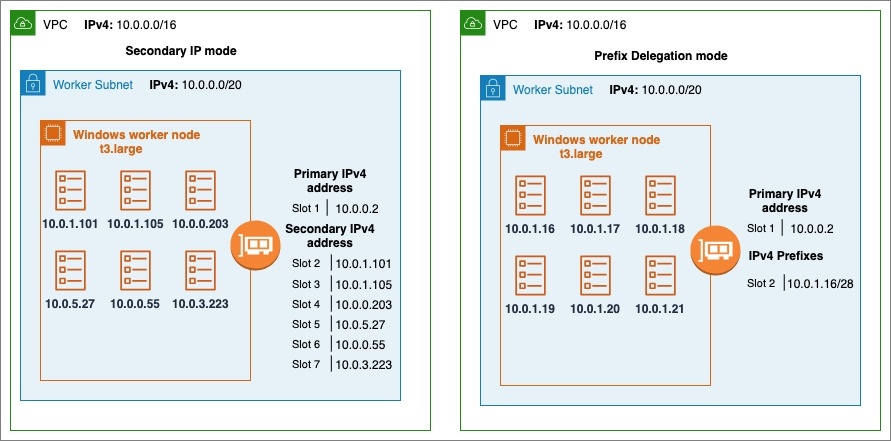
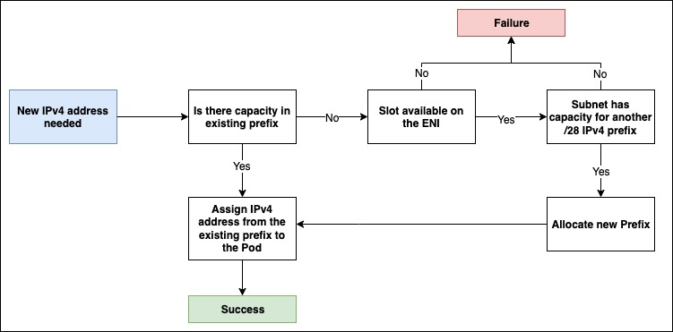

# Prefix Mode for Windows

In Amazon EKS, each Pods is allocated a VPC routable IP address and therefore, the number of Pods on the node is constrained by the available IP addresses even if there are sufficient resources to run more pods on the node. The IP address management for Windows nodes is performed by [VPC Resource Controller](https://github.com/aws/amazon-vpc-resource-controller-k8s) which runs in control plane. More details about the workflow for IP address management of Windows nodes can be found [here](https://github.com/aws/amazon-vpc-resource-controller-k8s#windows-ipv4-address-management).

In order to increase the number of IPv4 addresses available on the node, you can enable `Prefix Delegation` for Windows nodes so that instead of individual secondary IPv4 addresses, `/28 IPv4 prefixes` would be assigned to the slots on the node Elastic Network Interface (ENI). Prefix assignment mode can be enabled by adding `enable-windows-prefix-delegation: "true"` entry in the `amazon-vpc-cni` config map. Note that this is the same config map where you need to set `enable-windows-ipam: "true"` entry for enabling Windows support.

Please follow the instructions mentioned in the [EKS user guide](https://docs.aws.amazon.com/eks/latest/userguide/cni-increase-ip-addresses.html) to enable Prefix Delegation mode for Windows nodes.



Figure: Comparison of Secondary IP mode with Prefix Delegation mode 

The maximum number of IP addresses that you can assign to a network interface depends on the instance type. Each prefix that you assign to a network interface counts as one IP address. For example, a `c5.large` instance has a limit of `10` IPv4 addresses per network interface. Each network interface for this instance has a primary IPv4 address. If a network interface has no secondary IPv4 addresses, you can assign up to 9 prefixes to the network interface. For each additional IPv4 address that you assign to a network interface, you can assign one less prefix to the network interface. Review the AWS EC2 documentation on [IP addresses per network interface per instance type](https://docs.aws.amazon.com/AWSEC2/latest/UserGuide/using-eni.html#AvailableIpPerENI) and [assigning prefixes to network interfaces.](https://docs.aws.amazon.com/AWSEC2/latest/UserGuide/ec2-prefix-eni.html)

During worker node initialization, the VPC Resource Controller assigns one or more prefixes to the primary ENI for faster pod startup by maintaining a warm pool of the IP addresses. The number of prefixes to be held in warm pool can be controlled by setting the following configuration parameters in `amazon-vpc-cni` config map.

* `warm-prefix-target`, the number of prefixes to be allocated in excess of current need.
* `warm-ip-target`, the number of IP addresses to be allocated in excess of current need.
* `minimum-ip-target`, the minimum number of IP addresses to be available at any time.
* `warm-ip-target` and/or `minimum-ip-target` if set will override `warm-prefix-target`.

As more Pods are scheduled on the node, additional prefixes will be requested for the existing ENI. When a Pod is scheduled on the node, VPC Resource Controller would first try to assign an IPv4 address from the existing prefixes on the node. If that is not possible, then a new IPv4 prefix will be requested as long as the subnet has the required capacity.



Figure: Workflow during assignment of IPv4 address to the Pod
## Recommendations

### Use Prefix Mode when

Use prefix mode if you are experiencing Pod density issue on the worker nodes. To avoid errors, we recommend examining the subnets for contiguous block of addresses for /28 prefix before migrating to prefix mode. Please refer “[Use Subnet Reservations to Avoid Subnet Fragmentation (IPv4)](https://docs.aws.amazon.com/vpc/latest/userguide/subnet-cidr-reservation.html)” section for Subnet reservation details. 

By default, the `max-pods` on the Windows nodes are set as `110`. For most instance types, this should be a reasonable limit. However, if you want to increase or decrease this limit, then add the following to the bootstrap command in your user data-
```
-KubeletExtraArgs '--max-pods=example-value'
```
For more details about the bootstrap configuration parameters for Windows nodes, please visit the documentation [here](https://docs.aws.amazon.com/eks/latest/userguide/eks-optimized-windows-ami.html#bootstrap-script-configuration-parameters).

### Avoid Prefix Mode when

If your subnet is very fragmented and has insufficient available IP addresses to create /28 prefixes, avoid using prefix mode. The prefix attachment may fail if the subnet from which the prefix is produced is fragmented (a heavily used subnet with scattered secondary IP addresses). This problem may be avoided by creating a new subnet and reserving a prefix.

### Configure tuning parameters for prefix delegation to conserve IPv4 addresses

`warm-prefix-target`, `warm-ip-target`, and `minimum-ip-target` can be used to fine tune the behaviour of pre-scaling and dynamic scaling with prefixes. By default, the following values are used-
```
warm-ip-target: "1"
minimum-ip-target: "3"
```

By fine tuning these configuration parameters, you can achieve an optimal balance of conserving the IP addresses and ensuring decreased Pod latency due to assignment of IP address. For more information about these configuration parameters, visit the documentation [here](https://github.com/aws/amazon-vpc-resource-controller-k8s/blob/master/docs/windows/prefix_delegation_config_options.md).

### Use Subnet Reservations to Avoid Subnet Fragmentation (IPv4)

When EC2 allocates a /28 IPv4 prefix to an ENI, it has to be a contiguous block of IP addresses from your subnet. If the subnet that the prefix is generated from is fragmented (a highly used subnet with scattered secondary IP addresses), the prefix attachment may fail, and you will see the following node event:

```
InsufficientCidrBlocks: The specified subnet does not have enough free cidr blocks to satisfy the request
```

To avoid fragmentation and have sufficient contiguous space for creating prefixes, you may use [VPC Subnet CIDR reservations](https://docs.aws.amazon.com/vpc/latest/userguide/subnet-cidr-reservation.html#work-with-subnet-cidr-reservations) to reserve IP space within a subnet for exclusive use by prefixes. Once you create a reservation, the IP addresses from the reserved blocks will not be assigned to any other resource. That way, VPC Resource Controller will be able to get available prefixes during the assignment call to the node ENI.

It is recommended to create a new subnet, reserve space for prefixes, and enable prefix assignment for worker nodes running in that subnet. If the new subnet is dedicated only to Pods running in your EKS cluster with prefix delegation enabled, then you can skip the prefix reservation step.

### Replace all nodes during migration from Secondary IP mode to Prefix Delegation mode or vice versa

It is highly recommended that you create new node groups to increase the number of available IP addresses rather than doing rolling replacement of existing worker nodes.

When using self-managed node groups, the steps for transition would be-
- Increase the capacity in your cluster such that the new nodes would be able to accomodate your workloads
- Enable/Disable the Prefix Delegation feature for Windows
- Cordon and drain all the existing nodes to safely evict all of your existing Pods. To prevent service disruptions, we suggest implementing [Pod Disruption Budgets](https://kubernetes.io/docs/tasks/run-application/configure-pdb) on your production clusters for critical workloads.
- After you confirm the Pods are running, you can delete the old nodes and node groups. Pods on new nodes will be assigned an IPv4 address from a prefix assigned to the node ENI.

When using managed node groups, the steps for transition would be-
- Enable/Disable the Prefix Delegation feature for Windows
- Update the node group using the steps mentioned [here](https://docs.aws.amazon.com/eks/latest/userguide/update-managed-node-group.html). This performs similar steps as above but are managed by EKS.

!!! warning
    Run all Pods on a node in the same mode

For Windows, we recommend that Pods in both Secondary IP mode and Prefix delegation mode should not be ran on a node at the same time. Such a situation can arise when you migrate from Secondary IP mode to Prefix delegation mode or vice versa with running Windows workloads.

While this will not impact your running Pods, there can be inconsistency with respect to the node IP address capacity. For example, consider that you have a `t3.xlarge` node which has `14` slots for secondary IPv4 addresses. If say, you are running 10 Pods then 10 slots on the ENI will be used for the Pod assigned IPv4 addresses. Now the advertised capacity to Kube API server with Prefix Delegation mode would be `(14 * 16 = 224)` but the actual capacity at that moment would be `(4 * 16 = 64)`. Therefore, this capacity inconsistency can cause issues if you start running more Pods on the node which have IPv4 addresses from the prefixes.

That being said, you can use the migration strategy as described above to safely transition your Pods from secondary IP address to addresses from Prefixes. When toggling between the modes, the Pods would continue running normally and-
- When toggling from secondary IP mode to prefix delegation mode, the secondary IP addresses assigned to the running pods will not be released. Prefixes would be assigned on the free slots for secondary IP address on the ENI. Once the pod is terminated, the secondary IP will be released.
- When toggling from prefix delegation mode to secondary IP mode, a prefix will be released if all the IPs within its range are not allocated to any pod. If any IP from the prefix is assigned to a pod then that prefix will be kept as is until the pods are terminated upon which the prefix will be released.

### Debugging Issues with Prefix Delegation

You can use our debugging guide [here](https://github.com/aws/amazon-vpc-resource-controller-k8s/blob/master/docs/troubleshooting.md) to deep dive into the issue you are facing with prefix delegation on Windows.