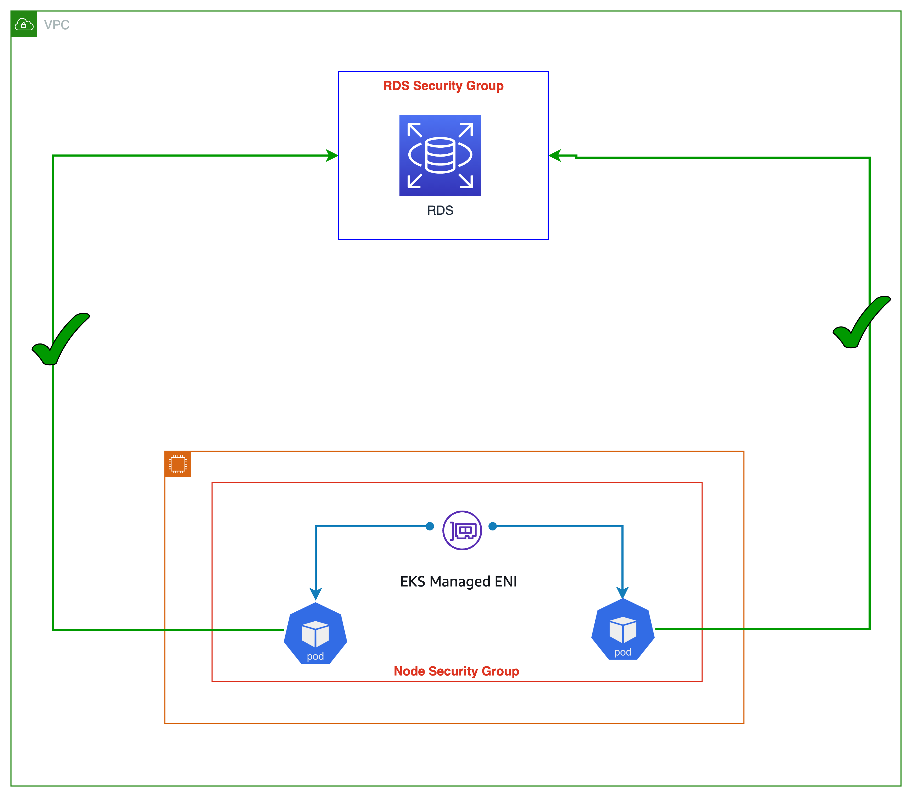
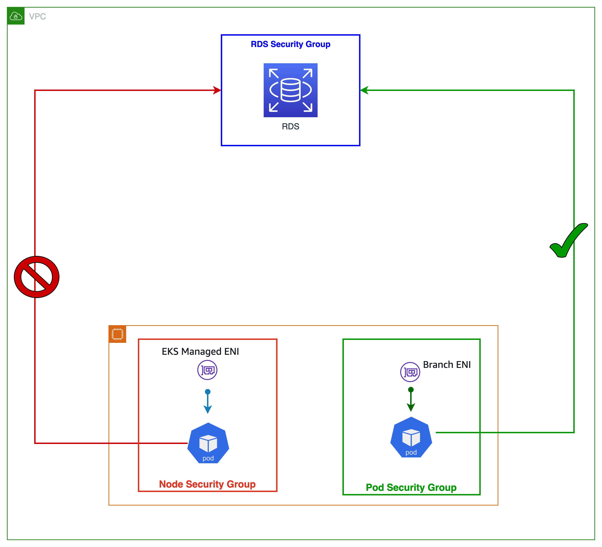
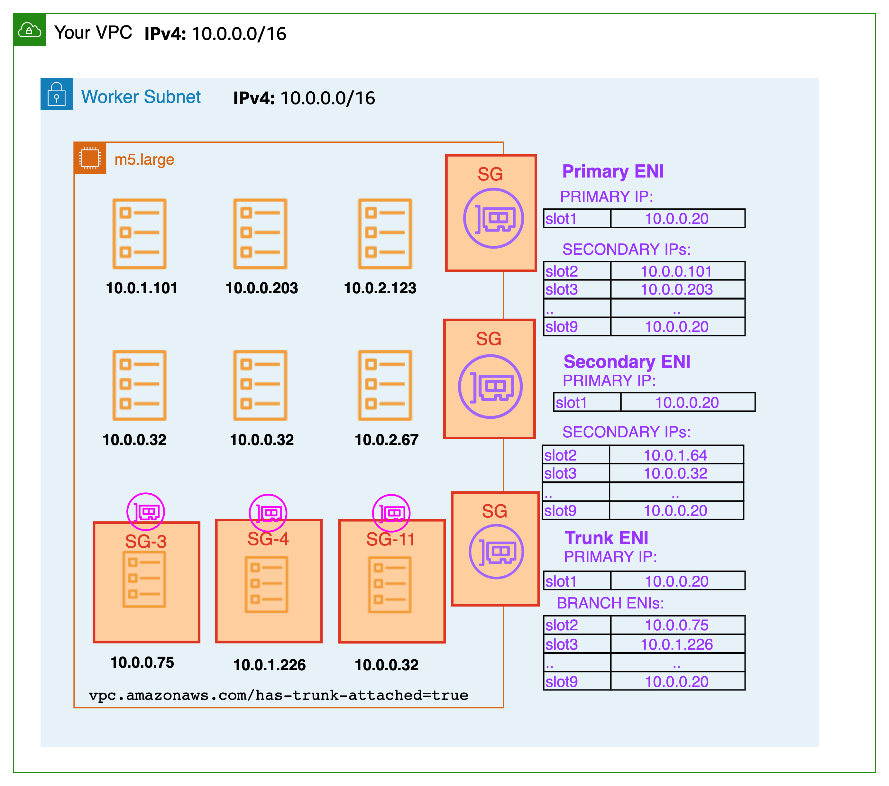

# Security Groups Per Pod

An AWS security group acts as a virtual firewall for EC2 instances to control inbound and outbound traffic. By default, the Amazon VPC CNI will use security groups associated with the primary ENI on the node. More specifically, every ENI associated with the instance will have the same EC2 Security Groups. Thus, every Pod on a node shares the same security groups as the node it runs on. 

As seen in the image below, all application Pods operating on worker nodes will have access to the RDS database service (considering RDS inbound allows node security group). Security groups are too coarse grained because they apply to all Pods running on a node. Security groups for Pods provides network segmentation for workloads which is an essential part a good defense in depth strategy.


With security groups for Pods, you can improve compute efficiency by running applications with varying network security requirements on shared compute resources. Multiple types of security rules, such as Pod-to-Pod and Pod-to-External AWS services, can be defined in a single place with EC2 security groups and applied to workloads with Kubernetes native APIs. The image below shows security groups applied at the Pod level and how they simplify your application deployment and node architecture. The Pod can now access Amazon RDS database.



You can enable security groups for Pods by setting `ENABLE_POD_ENI = true` for VPC CNI. Once this setting is set to `true`, for each node in the cluster the add-on adds a label with the value `vpc.amazonaws.com/has-trunk-attached=true`. When you enable Pod ENI, the “[VPC Resource Controller](https://github.com/aws/amazon-vpc-resource-controller-k8s)“ running on the control plane (managed by EKS) creates and attaches a trunk interface called “aws-k8s-trunk-eni“ to the node. The trunk interface acts as a standard network interface attached to the instance. To manage trunk interfaces, you must add the `AmazonEKSVPCResourceController` managed policy to the cluster role that goes with your Amazon EKS cluster.

The controller also creates branch interfaces named "aws-k8s-branch-eni" and associates them with the trunk interface. Pods are assigned a security group using the [SecurityGroupPolicy](https://github.com/aws/amazon-vpc-resource-controller-k8s/blob/master/config/crd/bases/vpcresources.k8s.aws_securitygrouppolicies.yaml) custom resource and are associated with a branch interface. Since security groups are specified with network interfaces, we are now able to schedule Pods requiring specific security groups on these additional network interfaces. Review the[EKS User Guide Section on Security Groups for Pods,](https://docs.aws.amazon.com/eks/latest/userguide/security-groups-for-pods.html) including deployment prerequisites.



Branch interface capacity is *additive* to existing instance type limits for secondary IP addresses. Pods that use security groups are not accounted for in the max-pods formula and when you use security group for pods you need to consider raising the max-pods value or be ok with running fewer pods than the node can actually support.

A m5.large can have up to 9 branch network interfaces and up to 27 secondary IP addresses assigned to its standard network interfaces. As shown in the example below, the default max-pods for a m5.large is 29, and EKS counts the Pods that use security groups towards the maximum Pods. Please see the [EKS user guide](https://docs.aws.amazon.com/eks/latest/userguide/cni-increase-ip-addresses.html) for instructions on how to change the max-pods for nodes.

When security groups for Pods are used in combination with [custom networking](https://docs.aws.amazon.com/eks/latest/userguide/cni-custom-network.html), the security group defined in security groups for Pods is used rather than the security group specified in the ENIConfig. As a result, when custom networking is enabled, carefully assess security group ordering while using security groups per Pod.

## Recommendations

### Disable TCP Early Demux for Liveness Probe

If are you using liveness or readiness probes, you also need to disable TCP early demux, so that the kubelet can connect to Pods on branch network interfaces via TCP. This is only required in strict mode. To do this run the following command:

```
kubectl edit daemonset aws-node -n kube-system
```


Under the `initContainer` section, change the value for `DISABLE_TCP_EARLY_DEMUX` to `true.`

### Use Security Group For Pods to leverage existing AWS configuration investment.

Security groups makes it easier to restrict network access to VPC resources, such as RDS databases or EC2 instances. One clear advantage of security groups per Pod is the opportunity to reuse existing AWS security group resources. 
If you are using security groups as a network firewall to limit access to your AWS services, we propose applying security groups to Pods using branch ENIs. Consider using security groups for Pods if you are transferring apps from EC2 instances to EKS and limit access to other AWS services with security groups.

### Configure Pod Security Group Enforcing Mode

Amazon VPC CNI plugin version 1.11 added a new setting named `POD_SECURITY_GROUP_ENFORCING_MODE` (“enforcing mode”). The enforcing mode controls both which security groups apply to the pod, and if source NAT is enabled. You may specify the enforcing mode as either strict or standard. Strict is the default, reflecting the previous behavior of the VPC CNI with `ENABLE_POD_ENI` set to `true`. 

In Strict Mode, only the branch ENI security groups are enforced. The source NAT is also disabled. 

In Standard Mode, the security groups associated with both the primary ENI and branch ENI (associated with the pod) are applied. Network traffic must comply with both security groups. 

*!!! Warning*
    Any mode change will only impact newly launched Pods. Existing Pods will use the mode that was configured when the Pod was created. Customers will need to recycle existing Pods with security groups if they want to change the traffic behavior. *

### Enforcing Mode: Use Strict mode for isolating pod and node traffic:

By default, security groups for Pods is set to "strict mode." Use this setting if you must completely separate Pod traffic from the rest of the node's traffic. In strict mode, the source NAT is turned off so the branch ENI outbound security groups can be used. 

!!! Warning
    When strict mode is enabled, all outbound traffic from a pod will leave the node and enter the VPC network. Traffic between pods on the same node will go over the VPC. This increases VPC traffic and limits node-based features. The NodeLocal DNSCache is not supported with strict mode. 

### Enforcing Mode: Use Standard mode in the following situations

**Client source IP visible to the containers in the Pod**

If you need to keep the client source IP visible to the containers in the Pod, consider setting `POD_SECURITY_GROUP_ENFORCING_MODE` to `standard`. Kubernetes services support externalTrafficPolicy=local to support preservation of the client source IP (default type cluster). You can now run Kubernetes services of type NodePort and LoadBalancer using instance targets with an externalTrafficPolicy set to Local in the standard mode. `Local` preserves the client source IP and avoids a second hop for LoadBalancer and NodePort type Services.

**Deploying NodeLocal DNSCache**

When using security groups for pods, configure standard mode to support Pods that use [NodeLocal DNSCache](https://kubernetes.io/docs/tasks/administer-cluster/nodelocaldns/). NodeLocal DNSCache improves Cluster DNS performance by running a DNS caching agent on cluster nodes as a DaemonSet. This will help the pods that have the highest DNS QPS requirements to query local kube-dns/CoreDNS having a local cache, which will improve the latency.

NodeLocal DNSCache is not supported in strict mode as all network traffic, even to the node, enters the VPC. 

**Supporting Kubernetes Network Policy**

We recommend using standard enforcing mode when using network policy with Pods that have associated security groups.
We strongly recommend to utilize security groups for Pods to limit network-level access to AWS services that are not part of a cluster. Consider network policies to restrict network traffic between Pods inside a cluster, often known as East/West traffic. 

### Identify Incompatibilities with Security Groups per Pod 

Windows-based and non-nitro instances do not support security groups for Pods. To utilize security groups with Pods, the instances must be tagged with isTrunkingEnabled. Use network policies to manage access between Pods rather than security groups if your Pods do not depend on any AWS services within or outside of your VPC.

### Use Security Groups per Pod to efficiently control traffic to AWS Services

If an application running within the EKS cluster has to communicate with another resource within the VPC, e.g. an RDS database, then consider using SGs for pods. While there are policy engines that allow you to specify an CIDR or a DNS name, they are a less optimal choice when communicating with AWS services that have endpoints that reside within a VPC.

In contrast, Kubernetes [network policies](https://kubernetes.io/docs/concepts/services-networking/network-policies/) provide a mechanism for controlling ingress and egress traffic both within and outside the cluster. Kubernetes network policies should be considered if your application has limited dependencies on other AWS services. You can configure may configure network policies that specify egress rules based on CIDR ranges to limit access to AWS services as opposed to AWS native semantics like SGs. You may use Kubernetes network policies to control network traffic between Pods (often referred to as East/West traffic) and between Pods and external services. Kubernetes network policies are implemented at OSI levels 3 and 4. 

Amazon EKS allows you to use network policy engines such as [Calico](https://projectcalico.docs.tigera.io/getting-started/kubernetes/managed-public-cloud/eks) and [Cilium](https://docs.cilium.io/en/stable/intro/). By default, the network policy engines are not installed. Please check the respective install guides for instructions on how to set up. For more information on how to use network policy, see [EKS Security best practices](https://aws.github.io/aws-eks-best-practices/security/docs/network/#network-policy). The DNS hostnames feature is available in the enterprise versions of network policy engines, which could be useful for controlling traffic between Kubernetes Services/Pods and resources that run outside of AWS. Also, you can consider DNS hostname support for AWS services that don't support security groups by default.

### Tag a single Security Group to use AWS Loadbalancer Controller

When many security groups are allocated to a Pod, Amazon EKS recommends tagging a single security group with [`kubernetes.io/cluster/$name`](http://kubernetes.io/cluster/$name) shared or owned. The tag allows the AWS Loadbalancer Controller to update the rules of security groups to route traffic to the Pods. If just one security group is given to a Pod, the assignment of a tag is optional. Permissions set in a security group are additive, therefore tagging a single security group is sufficient for the loadbalancer controller to locate and reconcile the rules. It also helps to adhere to the [default quotas](https://docs.aws.amazon.com/vpc/latest/userguide/amazon-vpc-limits.html#vpc-limits-security-groups) defined by security groups.

### Configure NAT for Outbound Traffic

Source NAT is disabled for outbound traffic from Pods that are assigned security groups. For Pods using security groups that require access the internet launch worker nodes on private subnets configured with a NAT gateway or instance and enable [external SNAT](https://docs.aws.amazon.com/eks/latest/userguide/external-snat.html) in the CNI.

```
kubectl set env daemonset -n kube-system aws-node AWS_VPC_K8S_CNI_EXTERNALSNAT=true
```

### Deploy Pods with Security Groups to Private Subnets

Pods that are assigned security groups must be run on nodes that are deployed on to private subnets. Note that Pods with assigned security groups deployed to public subnets will not able to access the internet.

### Verify *terminationGracePeriodSeconds* in Pod Specification File

Ensure that `terminationGracePeriodSeconds` is non-zero in your Pod specification file (default 30 seconds). This is essential in order for Amazon VPC CNI to delete the Pod network from the worker node. When set to zero, the CNI plugin does not remove the Pod network from the host, and the branch ENI is not effectively cleaned up.


